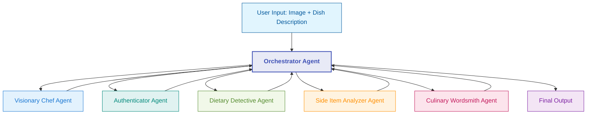

# Menu Maestro

An AI-powered system that transforms food images into comprehensive menu descriptions using a multi-agent architecture.

## Architecture

The system is composed of several specialized agents that work in a sequential and collaborative pipeline:



## Agent Roles

1. **Orchestrator Agent**: Manages the workflow between specialized agents
2. **Visionary Chef Agent**: Analyzes food images to identify ingredients and cooking methods
3. **Authenticator Agent**: Validates that dish descriptions match visual evidence
4. **Dietary Detective Agent**: Identifies allergens and dietary classifications
5. **Side Item Analyzer Agent**: Distinguishes between main dish components and sides
6. **Culinary Wordsmith Agent**: Generates engaging menu descriptions

## Detailed Setup and Usage Instructions

### Prerequisites

- Python 3.9 or higher
- AWS account with access to Amazon Bedrock
- AWS CLI installed and configured
- Terraform (for AWS deployments)
- Docker (optional, for containerized development)

### Local Development Setup

1. **Clone the repository**:
   ```bash
   git clone <repository-url>
   cd menu-maestro
   ```

2. **Set up environment variables**:
   ```bash
   cp .env.example .env
   ```

3. **Edit the `.env` file** with your AWS credentials and settings:
   ```
   # Environment
   ENVIRONMENT=local

   # AWS Configuration
   AWS_REGION=us-east-1
   AWS_ACCESS_KEY_ID=your_access_key_id
   AWS_SECRET_ACCESS_KEY=your_secret_access_key

   # Bedrock Configuration
   BEDROCK_MODEL_ID=us.amazon.nova-pro-v1:0

   # Storage Configuration
   USE_S3=false
   S3_BUCKET=menu-maestro-images
   ```

4. **Make the run script executable**:
   ```bash
   chmod +x scripts/run_local.sh
   ```

5. **Run the application**:
   ```bash
   ./scripts/run_local.sh
   ```

6. **Access the application** in your browser at http://localhost:8501

7. **Using the application locally**:
   - Enter a dish description (e.g., "Grilled Salmon with Asparagus")
   - Upload an image of the dish
   - Select the spice level
   - Click "Generate Menu Description"
   - Review the generated description, dietary information, and side items
   - Provide feedback to refine the description if needed

### Docker Setup (Alternative Local Development)

1. **Build and run with Docker Compose**:
   ```bash
   docker-compose up --build
   ```

2. **Access the application** in your browser at http://localhost:8501

### AWS Lambda Architecture Setup

1. **Configure AWS CLI** if you haven't already:
   ```bash
   aws configure
   ```

2. **Create an S3 bucket** for Terraform state (optional but recommended):
   ```bash
   aws s3 mb s3://menu-maestro-terraform-state
   ```

3. **Update Terraform backend configuration** (optional):
   Edit `infra/lambda/terraform/main.tf` to add:
   ```hcl
   terraform {
     backend "s3" {
       bucket = "menu-maestro-terraform-state"
       key    = "lambda/terraform.tfstate"
       region = "us-east-1"
     }
   }
   ```

4. **Make the deployment script executable**:
   ```bash
   chmod +x scripts/deploy_lambda.sh
   ```

5. **Deploy the Lambda architecture**:
   ```bash
   ./scripts/deploy_lambda.sh
   ```

6. **Note the API Gateway URL** from the Terraform output:
   ```bash
   cd infra/lambda/terraform
   terraform output api_gateway_url
   ```

7. **Test the API** with curl or Postman:
   ```bash
   # Convert an image to base64
   BASE64_IMAGE=$(base64 -i path/to/your/image.jpg)
   
   # Send a request to the API
   curl -X POST https://<api-gateway-url>/menu-description \
     -H "Content-Type: application/json" \
     -d "{\"dish_name\": \"Grilled Salmon with Asparagus\", \"image\": \"$BASE64_IMAGE\", \"spice_level\": \"Medium\"}"
   ```

8. **Create a simple web frontend** (optional):
   - Create an HTML file with a form to upload images and enter dish descriptions
   - Use JavaScript to convert the image to base64 and send it to the API
   - Display the results on the page

### AWS Bedrock Agents Architecture Setup

1. **Configure AWS CLI** if you haven't already:
   ```bash
   aws configure
   ```

2. **Make the deployment script executable**:
   ```bash
   chmod +x scripts/deploy_bedrock.sh
   ```

3. **Deploy the infrastructure**:
   ```bash
   ./scripts/deploy_bedrock.sh
   ```

4. **Create the Bedrock Agent manually** in the AWS Console:
   
   a. **Go to the AWS Console** > Amazon Bedrock > Agents
   
   b. **Create a new agent**:
      - Name: MenuMaestro
      - Description: AI-powered menu description generator
      - Model: Amazon Nova Pro
      - Instructions: "You are Menu Maestro, an AI system that generates comprehensive menu descriptions from food images. You analyze images to identify ingredients, cooking methods, and presentation style, then generate engaging descriptions."
   
   c. **Add action groups**:
   
      **1. ImageAnalysis Action Group**:
      - Name: ImageAnalysis
      - Description: Analyzes food images to identify ingredients and cooking methods
      - API Schema:
        ```json
        {
          "openapi": "3.0.0",
          "info": {
            "title": "Image Analysis API",
            "version": "1.0.0"
          },
          "paths": {
            "/analyze-image": {
              "post": {
                "summary": "Analyze a food image",
                "parameters": [
                  {
                    "name": "imageKey",
                    "in": "query",
                    "required": true,
                    "schema": {
                      "type": "string"
                    }
                  },
                  {
                    "name": "dishName",
                    "in": "query",
                    "required": true,
                    "schema": {
                      "type": "string"
                    }
                  }
                ],
                "responses": {
                  "200": {
                    "description": "Successful analysis"
                  }
                }
              }
            }
          }
        }
        ```
      - Lambda function: menu-maestro-action-group-handler
   
      **2. DishValidation Action Group**:
      - Name: DishValidation
      - Description: Validates that dish descriptions match visual evidence
      - API Schema: (similar to above, with appropriate parameters)
      - Lambda function: menu-maestro-action-group-handler
   
      **3. DietaryAnalysis Action Group**:
      - Name: DietaryAnalysis
      - Description: Identifies allergens and dietary classifications
      - API Schema: (similar to above, with appropriate parameters)
      - Lambda function: menu-maestro-action-group-handler
   
      **4. SideItemAnalysis Action Group**:
      - Name: SideItemAnalysis
      - Description: Distinguishes between main dish components and sides
      - API Schema: (similar to above, with appropriate parameters)
      - Lambda function: menu-maestro-action-group-handler
   
      **5. DescriptionGeneration Action Group**:
      - Name: DescriptionGeneration
      - Description: Generates engaging menu descriptions
      - API Schema: (similar to above, with appropriate parameters)
      - Lambda function: menu-maestro-action-group-handler
   
   d. **Build and deploy the agent**
   
   e. **Test the agent** using the AWS Console test interface

5. **Integrate with your application** using the Bedrock Agents API:
   ```python
   import boto3
   
   bedrock_agent_runtime = boto3.client('bedrock-agent-runtime')
   
   response = bedrock_agent_runtime.invoke_agent(
       agentId='your-agent-id',
       agentAliasId='your-agent-alias-id',
       sessionId='unique-session-id',
       inputText='Generate a description for my Grilled Salmon dish'
   )
   ```

## Troubleshooting

### Common Issues

1. **AWS Credentials Not Found**:
   - Ensure your AWS credentials are properly configured in `~/.aws/credentials` or in the `.env` file
   - Run `aws sts get-caller-identity` to verify your credentials are working

2. **Bedrock Access Issues**:
   - Verify your AWS account has access to Amazon Bedrock
   - Check that you've enabled the Nova Pro model in your AWS account
   - Ensure your IAM role has the necessary permissions

3. **Lambda Deployment Failures**:
   - Check CloudWatch Logs for detailed error messages
   - Verify that your Lambda function has the correct permissions
   - Ensure your Lambda function timeout is sufficient (30 seconds or more)

4. **Image Processing Issues**:
   - Ensure images are in JPG, JPEG, or PNG format
   - Check that images are not too large (keep under 5MB)
   - Verify that the image contains food items that can be recognized

## Directory Structure

```
menu-maestro/
│
├── app/                           # Application code
│   ├── agents/                    # Agent implementations
│   ├── utils/                     # Utility functions
│   ├── config.py                  # Configuration management
│   ├── app.py                     # Main Streamlit application
│   └── requirements.txt           # Python dependencies
│
├── infra/                         # Infrastructure as Code
│   ├── lambda/                    # Lambda architecture
│   │   ├── terraform/             # Terraform IaC
│   │   └── functions/             # Lambda function code
│   │
│   └── bedrock/                   # Bedrock Agents architecture
│       ├── terraform/             # Terraform IaC
│       └── action_groups/         # Bedrock Agent action groups
│
├── scripts/                       # Utility scripts
│   ├── deploy_lambda.sh           # Deploy Lambda architecture
│   ├── deploy_bedrock.sh          # Deploy Bedrock architecture
│   └── run_local.sh               # Run locally with Streamlit
│
├── .env.example                   # Example environment variables
├── Dockerfile                     # Docker configuration
├── docker-compose.yml             # Docker Compose for local development
└── README.md                      # Project documentation
```

## Technologies

- **Frontend**: Streamlit
- **AI Model**: Amazon Bedrock Nova Pro
- **Infrastructure**: AWS Lambda, API Gateway, S3, Bedrock Agents
- **IaC**: Terraform
- **Language**: Python