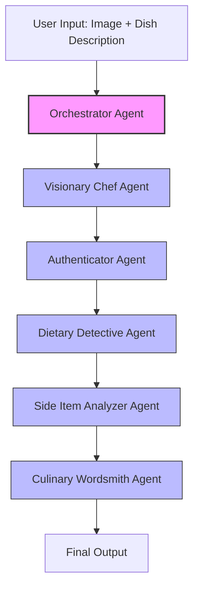

# Menu Maestro

An AI-powered system that transforms food images into comprehensive menu descriptions using a multi-agent architecture.

## Overview

Menu Maestro is an autonomous, multi-agent system designed to analyze a food image and generate a comprehensive and appealing menu description. It operates like a digital kitchen team, where each agent has a specialized role, from identifying ingredients to writing poetic copy.

## Architecture

The system is composed of several specialized agents that work in a sequential and collaborative pipeline:



### Agent Roles and Responsibilities

#### 1. Orchestrator Agent
- **Role**: Manages the workflow between specialized agents
- **Function**: Coordinates the entire process and compiles the final result
- **Input**: User-provided image and dish description
- **Output**: Structured data object with all analyses and the final description

#### 2. Visionary Chef Agent
- **Role**: Image analysis specialist
- **Function**: Identifies ingredients, cooking methods, and presentation style
- **Input**: Food image and dish description
- **Output**: Structured list of identified items with confidence scores

#### 3. Authenticator Agent
- **Role**: Quality control expert
- **Function**: Validates that the dish description aligns with the visual evidence
- **Input**: Dish description and Visionary Chef's analysis
- **Output**: Validation status and refined name suggestion

#### 4. Dietary Detective Agent
- **Role**: Food allergen and dietary restriction specialist
- **Function**: Identifies allergens and classifies dishes based on dietary restrictions
- **Input**: Visionary Chef's ingredient analysis
- **Output**: List of allergens, potential sensitivities, and dietary tags

#### 5. Side Item Analyzer Agent
- **Role**: Accompaniment and garnish specialist
- **Function**: Distinguishes between main dish components and side items
- **Input**: Food image and Visionary Chef's analysis
- **Output**: Categorized list of main components, sides, and garnishes

#### 6. Culinary Wordsmith Agent
- **Role**: Creative menu writer
- **Function**: Generates engaging, descriptive menu copy
- **Input**: All previous analyses and user feedback (if any)
- **Output**: Polished menu description

## Output Format

The system produces a structured JSON object containing:

- Refined dish name
- Engaging description
- Validation status
- Allergen information and dietary tags
- Side item analysis
- Identified components with confidence scores

## Features

- **Image Analysis**: Identifies ingredients, cooking methods, and presentation
- **Name Validation**: Ensures the dish description matches what's in the image
- **Allergen Detection**: Identifies potential allergens and dietary restrictions
- **Side Item Analysis**: Distinguishes between main dish and accompaniments
- **Creative Description**: Generates engaging menu copy
- **Feedback Loop**: Incorporates user feedback to refine descriptions

## Technologies

- **Frontend**: Streamlit
- **AI Model**: Amazon Bedrock Nova Pro
- **Language**: Python

## Setup and Usage

1. Install dependencies:
   ```
   pip install -r requirements.txt
   ```

2. Configure AWS credentials and region in `.env` file

3. Run the application:
   ```
   streamlit run app.py
   ```

4. Upload an image, provide a dish description, and let the AI chef team do the rest!